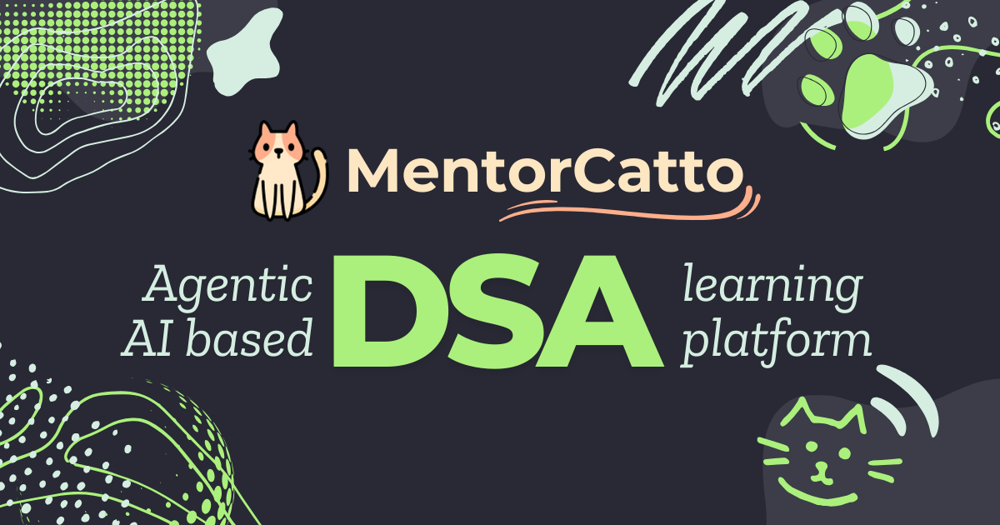
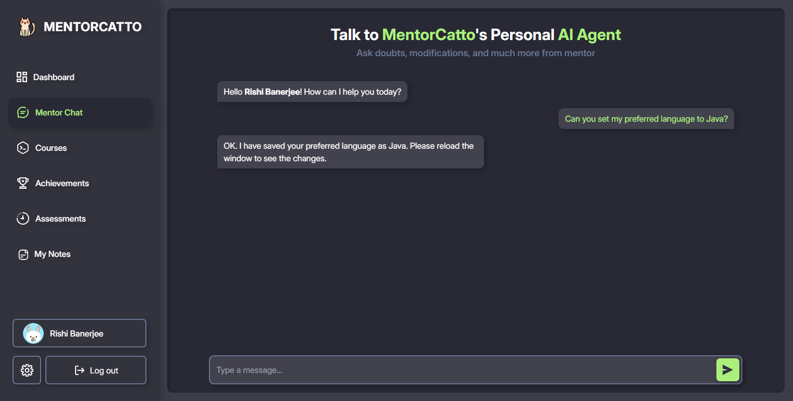
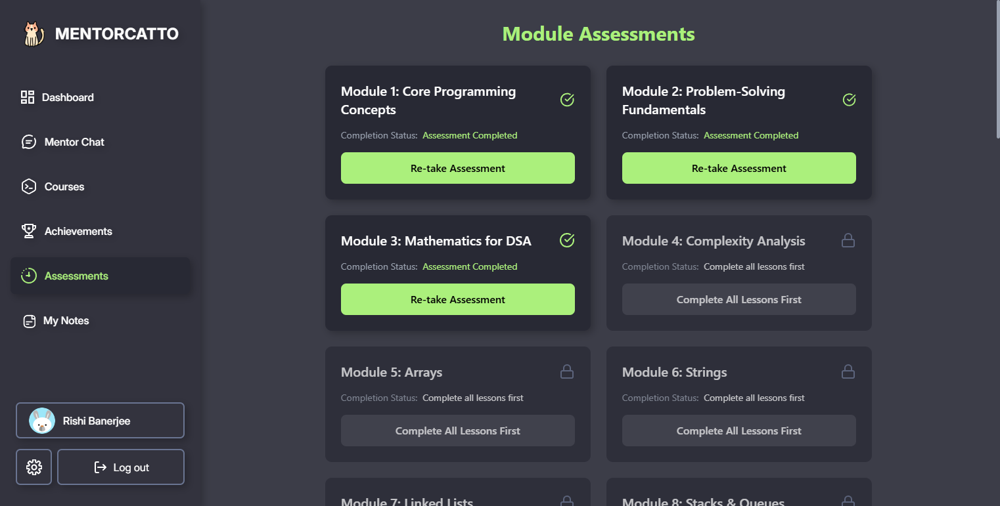
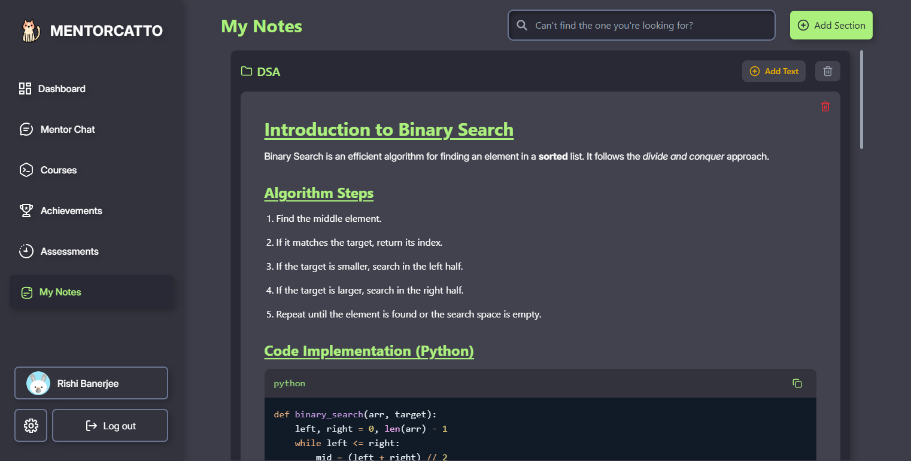

# 🐱🎓 MentorCatto



<p align="center"><strong>Agentic AI based personalized DSA Learning Platform — Learn, Practice, and Achieve!</strong></p>

**MentorCatto** is an AI-powered learning platform designed to help students master Data Structures and Algorithms (DSA). With an interactive AI mentor, structured courses, real-time coding practice _[Coming soon]_, and gamified achievements, MentorCatto makes DSA learning efficient and fun!  

---

## ✨ Preview

<div style="display: flex; justify-content: space-between;">
  
  
</div>

<div style="display: flex; justify-content: space-between;">
  
  
</div>

---

## ✨ Features  

### 🤖 AI Mentor Chat  
- Chat with an MentorCatto's Agentic AI mentor for instant guidance on DSA topics.  
- Ask for explanations, problem hints, request changes to course settings, or even ask for creating personalized notes.  
- Start practice sessions or assessments directly from the chat! _[Coming soon]_

### 📚 Structured DSA Courses  
- Learn DSA, in your preferred language, in a module-based system with clear progression.  
- Each module unlocks only after completing the previous one (customizable in settings).  
- Course content is AI-generated but optimized based on user feedback and user preferences.  

### 📝 Assessments & Quizzes  
- Take **module-wise tests** featuring MCQs, MSQs, short/long answer questions, and coding problems. _[Coming soon]_ 
- **Full-screen test mode** ensures focus and prevents distractions (leaving cancels the test). _[Coming soon]_ 
- Option to create **custom assessments** by selecting specific modules. _[Coming soon]_ 

### 💻 AI-Powered Coding Practice  
- Solve coding problems in an **interactive code editor** with real-time AI feedback. _[Coming soon]_ 
- AI provides **error explanations, hints, and code improvements** as you write. _[Coming soon]_ 
- Practice problems are structured by difficulty and topic. _[Coming soon]_ 

### 📒 My Notes – Smart AI-Powered Notes  
- Organize notes into **sections** for easy access.  
- Use **markup support** for clean and structured notes.  
- Ask the AI mentor to **auto-generate notes** based on a lesson or topic.  

### 🏆 Achievements & Badges  
- Earn badges by completing courses, assessments, and challenges. _[Coming soon]_ 
- View progress milestones and unlock special achievements. _[Coming soon]_ 
- A gamified approach to keep learning **fun and engaging**! _[Coming soon]_ 

### 🔧 Customizable Learning  
- Choose your **preferred language** for DSA learning.  
- Customize the **course unlock system** to learn at your own pace.  
- Modify settings directly via the AI Mentor.  

✅ **... and plenty more!**

---

## ✨ Demo Website _[Coming soon]_ 

We **will host** the demo website at [https://mentorcatto-qwertyfusion.vercel.app](https://mmentorcatto-qwertyfusion.vercel.app) in future. Stay tuned!

---

## 📜 License

MentorCatto is open-source and released under the **MIT License**.  
See the [LICENSE](./LICENSE) file for more details.

---

## 🚀 Getting Started

### 1️⃣ Clone the Repository

```bash
git clone https://github.com/QwertyFusion/mentorcatto.git
cd mentorcatto
```

### 2️⃣ Set Up Environment Variables in the `root` folder

Create a `.env` file and fill in the required fields as per `.env.example`.

### 3️⃣ Install Dependencies in `root` folder for backend dependencies:

```bash
npm install
# or
yarn install
# or
pnpm install
# or
bun install
```

### 4️⃣ Install Dependencies in `frontend` folder for frontend dependencies

```bash
cd .\frontend\
```

```bash
npm install
# or
yarn install
# or
pnpm install
# or
bun install
```

### 5️⃣ Run the backend server from the `root` folder

```bash
npm run dev
# or
yarn dev
# or
pnpm dev
# or
bun dev
```

Your backend should be running at [http://localhost:3000](http://localhost:3000)!

### 6️⃣ Run the frontend server from the `frontend` folder

```bash
cd .\frontend\
```

```bash
npm run dev
# or
yarn dev
# or
pnpm dev
# or
bun dev
```

Now, open [http://localhost:5173](http://localhost:5173) in your browser to see **MentorCatto** in action!

---

<!-- 🛠 Tools Used -->
<h2>🛠 Tools Used</h2>
<ol>
  <li>Visual Studio Code</li>
  <li>Vite</li>
  <li>React.js</li>
  <li>JavaScript</li>
  <li>HTML</li>
  <li>CSS</li>
  <li>Tailwind CSS</li>
  <li>MongoDB</li>
  <li>MailTrap (Email Testing)</li>
  <li>Gemini API (GenAI & AI Agent)</li>
  <li>LangChain (AI Memory & Conversations)</li>
  <li>Git & GitHub (Version Control)</li>
</ol>

<!-- 🔗 Link to Tools -->
<h2>🔗 Link to Tools</h2>
<p align="left">
<a href="https://code.visualstudio.com" target="_blank" rel="noreferrer">
  
</a>&emsp;
<a href="https://vitejs.dev/" target="_blank" rel="noreferrer">
  
</a>&emsp;
<a href="https://react.dev/" target="_blank" rel="noreferrer">
  
</a>&emsp;
<a href="https://developer.mozilla.org/en-US/docs/Web/JavaScript" target="_blank" rel="noreferrer">
  
</a>&emsp;
<a href="https://developer.mozilla.org/en-US/docs/Web/HTML" target="_blank" rel="noreferrer">
  
</a>&emsp;
<a href="https://developer.mozilla.org/en-US/docs/Web/CSS" target="_blank" rel="noreferrer">
  
</a>&emsp;
<a href="https://tailwindcss.com/" target="_blank" rel="noreferrer">
  
</a>&emsp;
<a href="https://www.mongodb.com/" target="_blank" rel="noreferrer">
  
</a>&emsp;
<a href="https://mailtrap.io/" target="_blank" rel="noreferrer">
  
</a>&emsp;
<a href="https://ai.google.dev/" target="_blank" rel="noreferrer">
  
</a>&emsp;
<a href="https://www.langchain.com/" target="_blank" rel="noreferrer">
  
</a>&emsp;
<a href="https://git-scm.com/" target="_blank" rel="noreferrer">
  
</a>&emsp;
<a href="https://github.com/" target="_blank" rel="noreferrer">
  
</a>
</p>

<!-- Developer Info -->
<h2>💻 Developer</h2>
<ul>
  <li><a href="https://github.com/QwertyFusion">[@QwertyFusion]</a></li>
  <li><a href="https://github.com/HoaxBlade">[@HoaxBlade]</a></li>
  <li><a href="https://github.com/SHREEYA-DAS">[@SHREEYA-DAS]</a></li>
  <li><a href="https://github.com/stitipragyanbehera">[@stitipragyanbehera]</a></li>
</ul>
